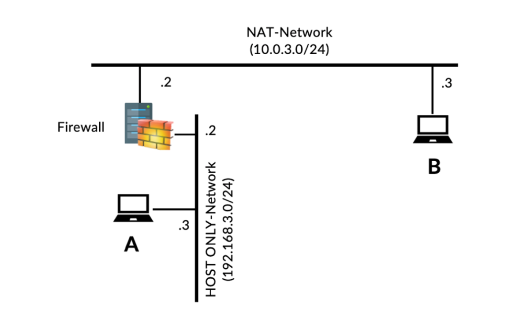

# pfSense Firewall & VPN Security


## Overview

This project demonstrates the deployment and configuration of a pfSense firewall to secure a small enterprise network.

The project focuses on implementing network access control policies, application-layer filtering, VPN connectivity, SSH tunneling, and web proxy services. Various attack and bypass techniques are tested to evaluate firewall effectiveness and understand common methods used to circumvent network restrictions.

## Objectives

- Deploy pfSense as a perimeter firewall
- Configure WAN and LAN interfaces
- Implement firewall rules for network segmentation
- Block unauthorized protocols and websites
- Evaluate firewall bypass techniques using SSH tunneling
- Configure Squid proxy for application-layer filtering
- Deploy VPN remote access through pfSense
- Validate firewall policies through practical testing

## Repository Structure

```text
pfsense/
│
├── img/
│   └── topology.png 
│
├── config-pfSense.home.arpa-20260731112046.xml
│
├── LICENSE
│
├── pfSense-UDP4-1194-user1-config.ovpn
│
├── README.md
│
└── Report.pdf
```

## Network Topology



## Technology Stack

- pfSense CE
- OpenVPN
- Squid Proxy
- Ubuntu Server
- VMware Workstation
- Firefox
- SSH
- Telnet

## Implementation

### Firewall Deployment

Configured pfSense with separate WAN and LAN interfaces to serve as the gateway between the internal network and the Internet.

Configuration included:

- WAN interface configuration
- LAN interface configuration
- Static IP assignment
- Default gateway configuration
- Web management interface

### Firewall Policy Enforcement

Implemented multiple firewall rules to restrict network access.

Security policies included:

- Block ICMP traffic to external hosts
- Block outbound HTTP traffic (TCP/80)
- Block Telnet connections
- Block access to Facebook
- Block access to YouTube

These policies were validated using clients located inside the protected network.

### SSH Tunnel Bypass

Evaluated how encrypted SSH tunnels can bypass traditional packet-filtering firewalls.

Implemented:

- Local Port Forwarding
- Dynamic Port Forwarding
- SOCKS5 Proxy
- Browser proxy configuration

Validation demonstrated that encrypted SSH traffic can encapsulate blocked services such as Telnet and web browsing without modifying firewall rules.

### Web Proxy (Squid)

Configured Squid as an application-layer proxy server.

Capabilities explored:

- HTTP proxy deployment
- Access control configuration
- URL rewriting
- Proxy-based traffic forwarding

A custom URL rewrite script was implemented to redirect specific websites, demonstrating Layer-7 traffic manipulation.

### VPN Deployment

Configured VPN services on pfSense to provide secure remote access into the protected LAN.

Deployment included:

- VPN server configuration
- Remote client configuration
- Secure encrypted tunnel establishment
- Internal resource accessibility testing

## Validation & Testing

| Test | Expected Result | Status |
| ------ | ----------------- | -------- |
| ICMP Blocking | Blocked | ✅ |
| HTTP Blocking | Blocked | ✅ |
| Telnet Blocking | Blocked | ✅ |
| Facebook Blocking | Blocked | ✅ |
| YouTube Blocking | Blocked | ✅ |
| SSH Tunnel Bypass | Successful | ✅ |
| Squid Proxy | Operational | ✅ |
| VPN Connection | Successful | ✅ |

## Key Findings

- pfSense effectively enforces Layer-3 and Layer-4 firewall policies.
- Traditional packet-filtering firewalls cannot inspect encrypted SSH tunnels.
- Squid enables Layer-7 traffic inspection and URL manipulation.
- VPN provides secure remote connectivity while maintaining network isolation.
- Combining firewall policies with proxy services provides stronger security controls than packet filtering alone.

## Skills Developed

### Network Security

- Firewall Administration
- Network Segmentation
- Access Control Lists
- Policy Enforcement

### VPN

- VPN Deployment
- Secure Remote Access
- Tunnel Configuration

### Firewall Evasion

- SSH Local Port Forwarding
- Dynamic Port Forwarding
- SOCKS Proxy
- Firewall Bypass Analysis

### Web Security

- Squid Proxy Configuration
- URL Rewriting
- HTTP Proxy Administration

### System Administration

- pfSense Configuration
- Ubuntu Server Administration
- Network Troubleshooting
